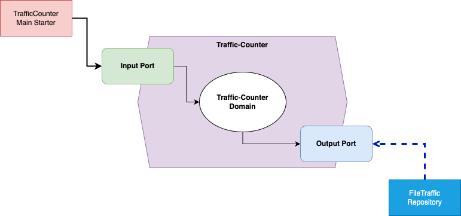

# Traffic-Counter

An automated traffic counter sits by a road and counts the number of cars that go past. 
Every half-hour the counter outputs the number of cars seen and resets the counter to zero. 
This particular traffic-counter app is a simple program that implements a system to manage this data.
The program reads a file, where each line contains a timestamp (in yyyy-mm- ddThh:mm:ss format, i.e. ISO 8601) for the beginning of a half-hour and the number of cars seen that half hour. 
The file was assumed to be placed in the designated folder (i.e., classpath).
You can assume that there will be another data pipeline that generate this file for you.
You can assume clean input, as these files are machine-generated.
However, how this file is generated will be out-of-scope of this application.

The program itself will output these following items:
• The number of cars seen in total
• A sequence of lines where each line contains a date (in yyyy-mm-dd format) and the
number of cars seen on that day (eg. 2016-11-23 289) for all days listed in the input file.
• The top 3 half hours with most cars, in the same format as the input file
• The 1.5 hour period with least cars (i.e. 3 contiguous half hour records)

We build this application by following what known as `Hexagonal Architecture`.
The reason for chosing this particular layered-architecture because we're looking to protect 
our business logic within the `domain` layer regardless of its application interface or any infrastructure layers such as database, framework, etc.



## Prequisites

- Java 17
- Maven 3+

## Running the Application with Maven

1. Compile the project by executing this following command from the project base directory
```shell
mvn clean package
```
2. Run the main starter
```shell
mvn exec:java -Dexec.mainClass="link.yauritux.TrafficCounterMainStarter"
```

## Running the Test

`mvn clean test`